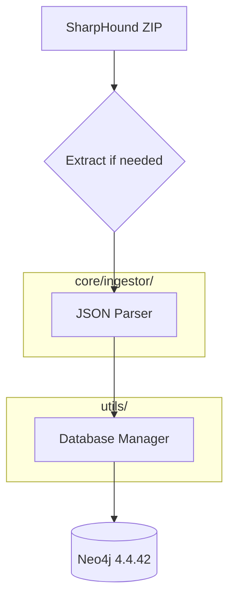

# Ingestion Function Design

The goal is to create a robust, minimal ingestion function in `core/ingestor/` that processes SharpHound ZIP files and imports them into Neo4j 4.4.42.

## Architecture

## Design Principles

1.  **Minimal Extraction**: Use `zipfile` to read JSON files directly from the ZIP archive without extracting to disk unless necessary for `ijson` streaming.
2.  **Batch Processing**: Utilize `ijson` for memory-efficient streaming of large JSON files.
3.  **Database Integration**: Leverage `utils/database.py` for connection management.
4.  **Data Mapping**: Reuse the logic from `bloodhound-import` for mapping nodes and relationships to ensure compatibility with the BloodHound data model.
5.  **Robustness**: Implement comprehensive logging and error handling for database transactions and file parsing.

## Proposed Structure

- `core/ingestor/ingestor.py`: Main ingestion logic.
- `core/ingestor/__init__.py`: Expose the main ingestion function.

## Workflow

1.  Initialize `DatabaseManager` from `utils/database.py`.
2.  Open ZIP file.
3.  Iterate through JSON files in the ZIP.
4.  For each JSON file, identify the object type (e.g., computers, users).
5.  Stream data using `ijson`.
6.  Execute batch transactions to Neo4j.
7.  Log progress and errors.
